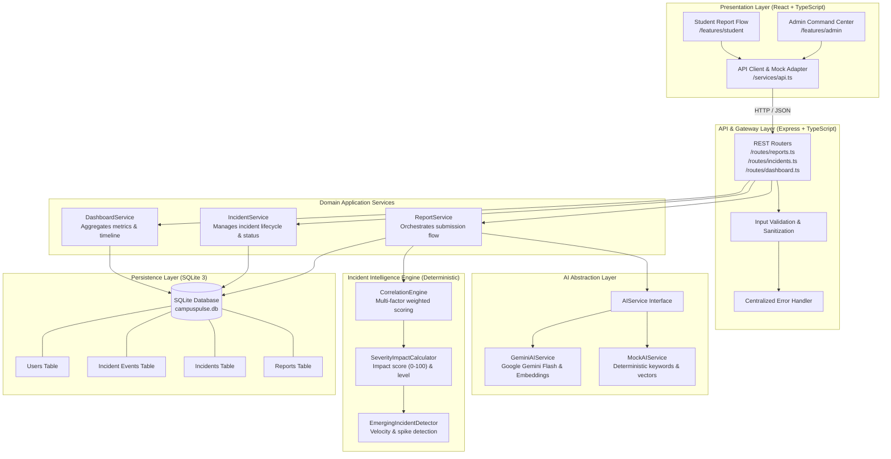

# CampusPulse AI — System Architecture & Technical Design

This document details the end-to-end technical architecture, layer responsibilities, component interactions, data flows, and design trade-offs for CampusPulse AI.

---

## 1. System Architecture Diagram



---

## 2. End-to-End Data Flow

The critical path for converting scattered student complaints into prioritized campus intelligence executes in 10 deterministic steps:

```
[1. Student Submits Report]
  │ Description: "WiFi is down in CSE Block Lab 3, can't submit assignment"
  │ Optional: Building, Room, Category
  ▼
[2. Express Route & Validation]
  │ POST /api/reports
  │ Validates presence of description; assigns UUID; logs receipt
  ▼
[3. AI Understanding & Extraction (AIService)]
  │ - Category Classification: 'NETWORK'
  │ - Subcategory: 'WIFI'
  │ - Location Extraction: building = 'CSE Block', room = 'Lab 3'
  │ - Vector Embedding: 64-dim/768-dim float array
  │ - Error Guard: If AI fails, fallback keyword extractor activates
  ▼
[4. Fetch Active Incidents]
  │ Retrieves all OPEN or INVESTIGATING incidents in database
  ▼
[5. Multi-Factor Correlation (CorrelationEngine)]
  │ Evaluates candidate incidents with multi-factor scoring:
  │   Score = (0.55 * CosineSim) + (0.20 * LocMatch) + (0.15 * CatMatch) + (0.10 * TimeDecay)
  │ If BestScore >= Threshold (0.70):
  │   Match found! Target incident identified.
  │ Else:
  │   No match! Flag for new Incident creation.
  ▼
[6. Incident Mutation (Create or Update)]
  │ If Match:
  │   - Append report to Incident (incident_id set)
  │   - Increment report count
  │   - Record correlation score & human-readable explanation
  │ If No Match:
  │   - Create new Incident with initial report
  ▼
[7. Dynamic Severity & Impact Calculation]
  │ ImpactScore = Base(Category) + (ReportCount * 8) + BuildingWeight
  │ Capped at 100. Severity updated (LOW, MEDIUM, HIGH, CRITICAL)
  ▼
[8. Emerging Incident Detection]
  │ Computes report arrival velocity (reports/hour).
  │ If reports >= 3 within 60 minutes or velocity surge > 2x:
  │   Flag incident: is_emerging = true
  │   Generate incident timeline event: 'EMERGING_FLAGGED'
  ▼
[9. AI Summary & Action Recommendation]
  │ For new or updated incidents, AIService generates:
  │   - High-level executive summary
  │   - Prescriptive recommended action for campus facilities
  ▼
[10. Persist & Return Response]
  │ Atomically commit to SQLite.
  │ Emit structured JSON response conforming to /shared/api-contract.md.
```

---

## 3. Layered Architectural Breakdown

### 3.1 Presentation Layer (`/frontend`)
- **Technology:** React 18+ with TypeScript, bundled with Vite.
- **Styling:** Vanilla CSS with scoped design tokens (`index.css`), glassmorphic panels, rich contrast palettes, and micro-animations.
- **Modules:**
  - `src/features/student`:
    - Clean, mobile-friendly report submission form.
    - Real-time location auto-suggest (Buildings: CSE Block, Mechanical Lab, Central Library, Admin Block, Science Annex).
    - Category selector with icon cards.
    - Submission receipt card showing ticket ID and tracking status.
  - `src/features/admin`:
    - Dashboard statistics bar (Active Incidents, Emerging Alerts, Unassigned Reports, Total Reports).
    - Filterable Incident Grid (filter by status, severity, category, emerging flag).
    - Detailed Incident Drawer/Page:
      - Correlated reports list with AI extraction chips (Room, Category).
      - Explainability banner explaining why reports were grouped.
      - Dynamic visual incident timeline (`incident_events`).
      - AI Summary & Facilities Recommendation card.
      - Status triage action buttons (Investigating, In Progress, Resolved).
  - `src/services/api.ts`: Centralized HTTP client wrapping `fetch` with environment-aware baseURL and fallback mock modes.

### 3.2 API & Routing Layer (`/backend/src/routes`, `/backend/src/controllers`)
- **Technology:** Express with TypeScript.
- **Role:** Route dispatching, input sanitation, HTTP status codes, and global error handling.
- **Principles:**
  - No business logic or database queries inside route handlers.
  - Route handlers immediately delegate to Domain Services.
  - Returns strictly formatted responses matching `/shared/api-contract.md`.

### 3.3 Application Service Layer (`/backend/src/services`)
- **`ReportService`:**
  - Orchestrates report ingestion.
  - Calls `AIService` for classification, extraction, and embedding.
  - Hands enriched report to `CorrelationEngine`.
  - Persists report, updates incident, and writes audit events.
- **`IncidentService`:**
  - Queries incidents with eager-loaded reports and timeline events.
  - Handles administrative status transitions (e.g. `OPEN` → `INVESTIGATING` → `RESOLVED`).
  - Records status transition events in `incident_events`.
- **`DashboardService`:**
  - Computes active incident counts, emerging incident warnings, severity distributions, and 24-hour activity timeline metrics.

### 3.4 AI Service Layer (`/backend/src/ai`)
Decoupled through the `AIService` interface:
```typescript
export interface AIService {
  classifyAndExtract(description: string, userCategory?: string, userBuilding?: string, userRoom?: string): Promise<AIExtractionResult>;
  generateEmbedding(text: string): Promise<number[]>;
  generateSummaryAndRecommendation(reports: ReportSummaryInput[]): Promise<AISummaryResult>;
}
```
- **`MockAIService`:** Uses deterministic keyword lookups, regex extractors, and static pseudo-embeddings (unit normalized 64-float vectors). Enables full offline operation without an API key or internet access.
- **`GeminiAIService`:** Uses `@google/genai` or the official Gemini REST endpoint using `gemini-1.5-flash` or `gemini-2.0-flash` with structured JSON output schemas (`responseSchema`).
- **Resilience Strategy:** The system attempts `GeminiAIService` if `GEMINI_API_KEY` is present; if it fails or throws a rate-limit error, it automatically falls back to `MockAIService` logic and records `ai_status: 'FAILED'`.

### 3.5 Incident Intelligence Engine (`/backend/src/engine`)
Completely deterministic, transparent, and explainable application logic:
- **`CorrelationEngine`:**
  - Evaluates similarity against currently active incidents.
  - Calculates cosine similarity between vector embeddings.
  - Evaluates geographic overlap (exact building match = 1.0, same zone = 0.5, mismatch = 0.0).
  - Evaluates category match (exact = 1.0, parent domain match = 0.5, mismatch = 0.0).
  - Evaluates temporal decay: exponentially decays older reports outside a 6-hour window.
  - Produces human-readable explainability string stored in `reports.correlation_reason`.
- **`SeverityImpactCalculator`:**
  - `impact_score = min(100, BaseSeverityScore + (reportCount * 8) + BuildingModifier)`
  - Categorizes into `LOW` (<30), `MEDIUM` (30-59), `HIGH` (60-84), `CRITICAL` (>=85).
- **`EmergingIncidentDetector`:**
  - Flags `is_emerging = true` when report volume velocity exceeds 3 reports within a 60-minute sliding window or report frequency doubles compared to the previous window.

### 3.6 Persistence Layer (`/backend/src/db`)
- **Engine:** SQLite 3 via `better-sqlite3` (or `sqlite3` driver).
- **Storage:** Local database file `./data/campuspulse.db`.
- **Schema Management:** Clean declarative SQL schema (`schema.sql`) executed on server startup with `CREATE TABLE IF NOT EXISTS` and performance indexing.

---

## 4. Key Design Decisions & Trade-Offs

| Decision | Alternatives Considered | Rationale for CampusPulse AI MVP |
|---|---|---|
| **SQLite instead of PostgreSQL + pgvector** | PostgreSQL, Pinecone, Qdrant | Zero external daemon dependencies, zero Docker requirement, instant deployment on any laptop, embeds easily in 48-hr hackathon demo. |
| **In-Memory Cosine Similarity** | Vector DB extension | For a campus incident system with 10-500 active reports, computing dot products of 64-768 length arrays in JS memory takes <2ms. External vector DB is massive over-engineering. |
| **Hybrid Weighted Correlation** | Pure Semantic Similarity | Semantic similarity alone groups "WiFi down in CSE" with "WiFi down in Sports Complex 2 miles away". Multi-factor weighting ensures spatial and temporal coherence. |
| **MockAIService Default Fallback** | Hard external API dependency | Guarantees that presentation, QA testing, and frontend development never freeze if external API keys expire, hit quota limits, or lack WiFi during demo. |
| **Shared API Contract & Types** | Ad-hoc endpoint integration | Prevents the #1 hackathon failure mode: Frontend and Backend discovering incompatible payload structures at hour 46. |

---

## 5. Failure Modes & Resilience Patterns

1. **AI API Rate Limit or Timeout:**
   - Catch error in `AIServiceAdapter`.
   - Set `report.ai_status = 'FAILED'`, `report.ai_error = err.message`.
   - Fall back to deterministic keyword categorization (`NETWORK`, `ELECTRICAL`, `PLUMBING`, `HVAC`, `PHYSICAL`).
   - Allow incident matching to proceed with fallback category and location.
2. **Empty or Missing Location in Student Submission:**
   - Fallback to `ai_extracted_building` or assign `"Unknown Building"`.
   - Admin UI highlights reports with missing locations in amber for manual triage.
3. **Database Concurrency in SQLite:**
   - `WAL` (Write-Ahead Logging) mode enabled via `PRAGMA journal_mode = WAL;`.
   - Ensures concurrent reads never block writes.
