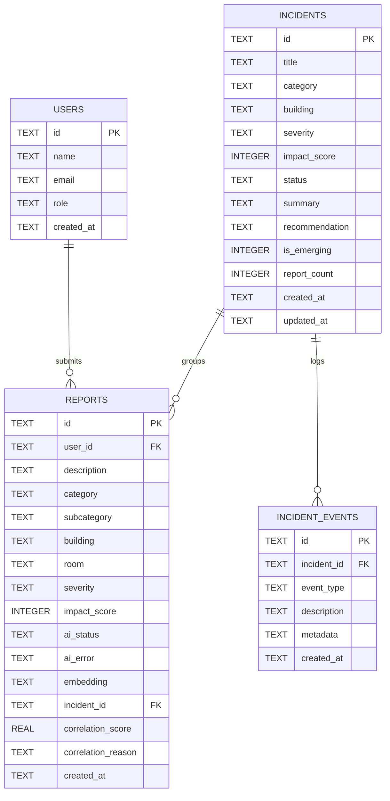

# CampusPulse AI — Database Schema & Data Architecture

This document defines the SQLite database architecture, entity relationships, schemas, constraints, indexes, and query patterns for CampusPulse AI.

---

## 1. Database Philosophy & Guidelines

- **Database Engine:** SQLite 3 (`better-sqlite3` or `sqlite3`).
- **File Location:** `/backend/data/campuspulse.db` (auto-created on startup).
- **Zero Heavy Infrastructure:** No PostgreSQL, Redis, or external vector databases.
- **Relational Integrity:** Foreign keys must be enabled on every connection:
  ```sql
  PRAGMA foreign_keys = ON;
  PRAGMA journal_mode = WAL;
  ```
- **Embedding Storage:** Embeddings are stored as JSON-encoded text arrays (e.g. `"[0.12, -0.05, 0.44, ...]"`). Cosine similarity calculations occur in memory inside the `CorrelationEngine`.

---

## 2. Entity-Relationship Diagram



---

## 3. Detailed Table Definitions

### 3.1 `users`
Stores campus community members submitting reports or administering incidents.

```sql
CREATE TABLE IF NOT EXISTS users (
    id TEXT PRIMARY KEY,
    name TEXT NOT NULL,
    email TEXT UNIQUE NOT NULL,
    role TEXT CHECK(role IN ('student', 'staff', 'admin')) NOT NULL DEFAULT 'student',
    created_at TEXT NOT NULL DEFAULT (datetime('now'))
);
```

| Column | Type | Constraints | Description |
|---|---|---|---|
| `id` | TEXT | PRIMARY KEY | UUID v4 or student ID (e.g., `usr_student_01`) |
| `name` | TEXT | NOT NULL | User's full name |
| `email` | TEXT | UNIQUE, NOT NULL | Campus email address |
| `role` | TEXT | CHECK IN ('student', 'staff', 'admin') | Access control role |
| `created_at` | TEXT | NOT NULL | ISO 8601 timestamp |

---

### 3.2 `incidents`
Represents correlated, aggregated campus infrastructure issues composed of one or more student reports.

```sql
CREATE TABLE IF NOT EXISTS incidents (
    id TEXT PRIMARY KEY,
    title TEXT NOT NULL,
    category TEXT CHECK(category IN ('NETWORK', 'ELECTRICAL', 'PLUMBING', 'HVAC', 'PHYSICAL', 'EQUIPMENT', 'SAFETY', 'OTHER')) NOT NULL,
    building TEXT NOT NULL,
    severity TEXT CHECK(severity IN ('LOW', 'MEDIUM', 'HIGH', 'CRITICAL')) NOT NULL DEFAULT 'LOW',
    impact_score INTEGER NOT NULL DEFAULT 0 CHECK(impact_score >= 0 AND impact_score <= 100),
    status TEXT CHECK(status IN ('OPEN', 'INVESTIGATING', 'IN_PROGRESS', 'RESOLVED', 'CLOSED')) NOT NULL DEFAULT 'OPEN',
    summary TEXT,
    recommendation TEXT,
    is_emerging INTEGER NOT NULL DEFAULT 0 CHECK(is_emerging IN (0, 1)),
    report_count INTEGER NOT NULL DEFAULT 1,
    created_at TEXT NOT NULL DEFAULT (datetime('now')),
    updated_at TEXT NOT NULL DEFAULT (datetime('now'))
);
```

| Column | Type | Constraints | Description |
|---|---|---|---|
| `id` | TEXT | PRIMARY KEY | UUID (e.g., `inc_8f91a0`) |
| `title` | TEXT | NOT NULL | Human-readable title (e.g., "CSE Block Network Failure") |
| `category` | TEXT | ENUM | Broad problem category |
| `building` | TEXT | NOT NULL | Primary affected building |
| `severity` | TEXT | ENUM | Computed severity tier |
| `impact_score` | INTEGER | 0 to 100 | Quantitative impact calculation |
| `status` | TEXT | ENUM | Triage lifecycle status |
| `summary` | TEXT | NULLABLE | AI-generated synthesized summary of all reports |
| `recommendation`| TEXT | NULLABLE | AI-generated actionable advice for maintenance staff |
| `is_emerging` | INTEGER | 0 or 1 | Flag indicating abnormal report velocity or surge |
| `report_count` | INTEGER | >= 1 | Cached count of correlated reports |
| `created_at` | TEXT | NOT NULL | ISO 8601 timestamp |
| `updated_at` | TEXT | NOT NULL | ISO 8601 timestamp of last report or status update |

---

### 3.3 `reports`
Individual incident reports submitted by students or staff.

```sql
CREATE TABLE IF NOT EXISTS reports (
    id TEXT PRIMARY KEY,
    user_id TEXT REFERENCES users(id) ON DELETE SET NULL,
    description TEXT NOT NULL,
    category TEXT CHECK(category IN ('NETWORK', 'ELECTRICAL', 'PLUMBING', 'HVAC', 'PHYSICAL', 'EQUIPMENT', 'SAFETY', 'OTHER')) NOT NULL DEFAULT 'OTHER',
    subcategory TEXT,
    building TEXT NOT NULL DEFAULT 'Unknown',
    room TEXT,
    severity TEXT CHECK(severity IN ('LOW', 'MEDIUM', 'HIGH', 'CRITICAL')) NOT NULL DEFAULT 'LOW',
    impact_score INTEGER NOT NULL DEFAULT 10,
    ai_status TEXT CHECK(ai_status IN ('PENDING', 'COMPLETED', 'FAILED')) NOT NULL DEFAULT 'PENDING',
    ai_error TEXT,
    embedding TEXT,
    incident_id TEXT REFERENCES incidents(id) ON DELETE SET NULL,
    correlation_score REAL,
    correlation_reason TEXT,
    created_at TEXT NOT NULL DEFAULT (datetime('now'))
);
```

| Column | Type | Constraints | Description |
|---|---|---|---|
| `id` | TEXT | PRIMARY KEY | UUID (e.g., `rep_12a3b4`) |
| `user_id` | TEXT | FK → `users(id)` | Submitting student |
| `description` | TEXT | NOT NULL | Raw text submitted by the user |
| `category` | TEXT | ENUM | Categorized issue domain |
| `subcategory` | TEXT | NULLABLE | Specific subcategory (e.g., `WIFI`, `OUTLET`) |
| `building` | TEXT | NOT NULL | Extracted or selected campus building |
| `room` | TEXT | NULLABLE | Extracted or selected room/lab |
| `severity` | TEXT | ENUM | Individual report severity |
| `impact_score` | INTEGER | 0 to 100 | Report contribution score |
| `ai_status` | TEXT | ENUM | AI processing state (`PENDING`, `COMPLETED`, `FAILED`) |
| `ai_error` | TEXT | NULLABLE | Error message if AI processing encountered failure |
| `embedding` | TEXT | NULLABLE | JSON serialized float array of text vector |
| `incident_id` | TEXT | FK → `incidents(id)` | Parent incident (assigned by CorrelationEngine) |
| `correlation_score` | REAL | 0.0 to 1.0 | Weighted similarity score matching parent incident |
| `correlation_reason`| TEXT | NULLABLE | Explainability string justifying correlation |
| `created_at` | TEXT | NOT NULL | ISO 8601 timestamp |

---

### 3.4 `incident_events`
Audit trail and chronological event log for incident timelines.

```sql
CREATE TABLE IF NOT EXISTS incident_events (
    id TEXT PRIMARY KEY,
    incident_id TEXT NOT NULL REFERENCES incidents(id) ON DELETE CASCADE,
    event_type TEXT CHECK(event_type IN ('CREATED', 'REPORT_LINKED', 'STATUS_CHANGED', 'SEVERITY_UPDATED', 'EMERGING_FLAGGED', 'AI_UPDATED')) NOT NULL,
    description TEXT NOT NULL,
    metadata TEXT,
    created_at TEXT NOT NULL DEFAULT (datetime('now'))
);
```

| Column | Type | Constraints | Description |
|---|---|---|---|
| `id` | TEXT | PRIMARY KEY | UUID |
| `incident_id` | TEXT | FK → `incidents(id)` | Target incident |
| `event_type` | TEXT | ENUM | Category of timeline event |
| `description` | TEXT | NOT NULL | Human-readable log entry (e.g. "Report rep_4 linked from Lab 3") |
| `metadata` | TEXT | NULLABLE | JSON object with before/after state details |
| `created_at` | TEXT | NOT NULL | ISO 8601 timestamp |

---

## 4. Performance Indexes

```sql
-- Fast lookups of active incidents during correlation
CREATE INDEX IF NOT EXISTS idx_incidents_status ON incidents(status);
CREATE INDEX IF NOT EXISTS idx_incidents_building ON incidents(building);
CREATE INDEX IF NOT EXISTS idx_incidents_category ON incidents(category);
CREATE INDEX IF NOT EXISTS idx_incidents_updated_at ON incidents(updated_at);

-- Fast report clustering and retrieval by incident
CREATE INDEX IF NOT EXISTS idx_reports_incident_id ON reports(incident_id);
CREATE INDEX IF NOT EXISTS idx_reports_created_at ON reports(created_at);
CREATE INDEX IF NOT EXISTS idx_reports_building ON reports(building);

-- Fast timeline generation
CREATE INDEX IF NOT EXISTS idx_incident_events_incident_id ON incident_events(incident_id, created_at);
```

---

## 5. Seed Data & Bootstrap Strategy

To ensure zero-setup local execution for all developers and instant demo readiness, the backend includes an automated initialization script (`backend/src/db/init.ts`):
1. Runs schema DDL statements sequentially.
2. Seeds default test accounts (`student@campus.edu`, `admin@campus.edu`).
3. If `--seed-demo` argument is passed, imports `/demo-data/demo-scenario.json` into the database to reproduce the canonical demonstration path.
